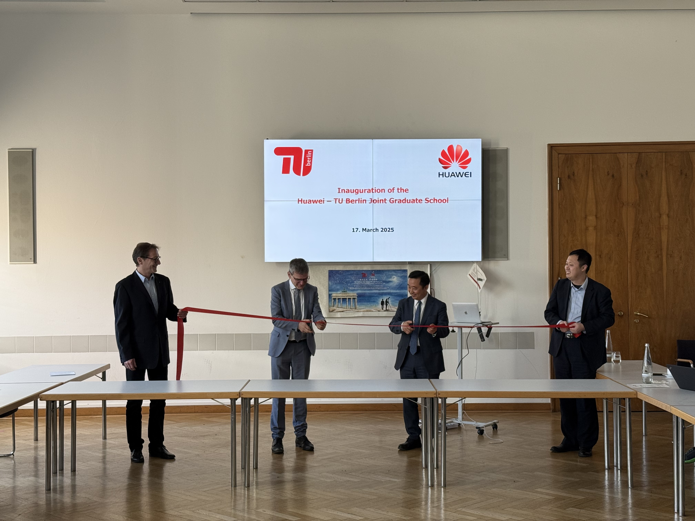
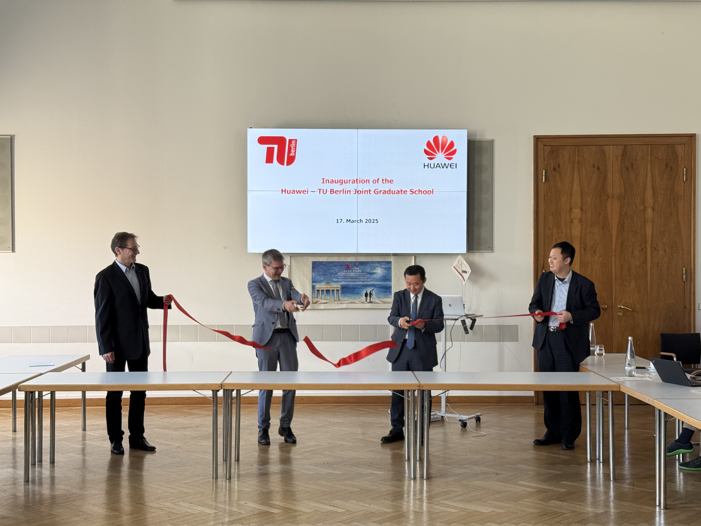
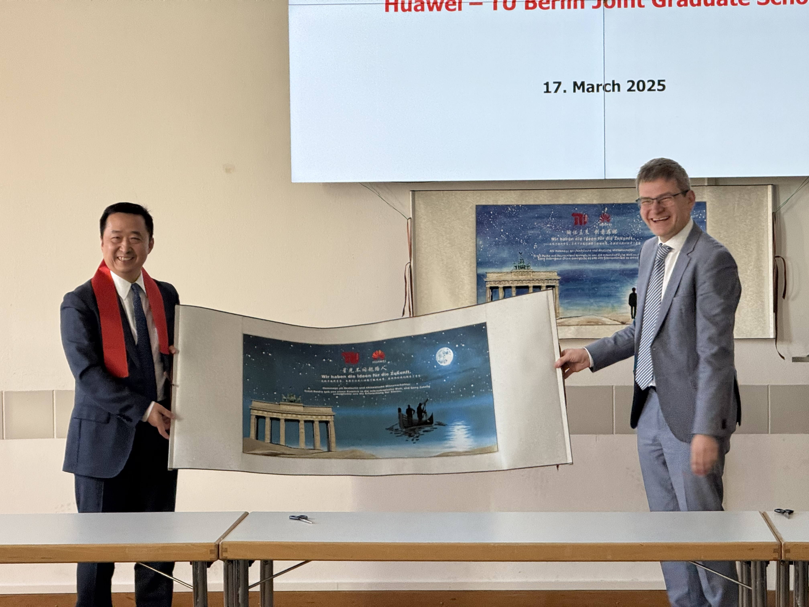
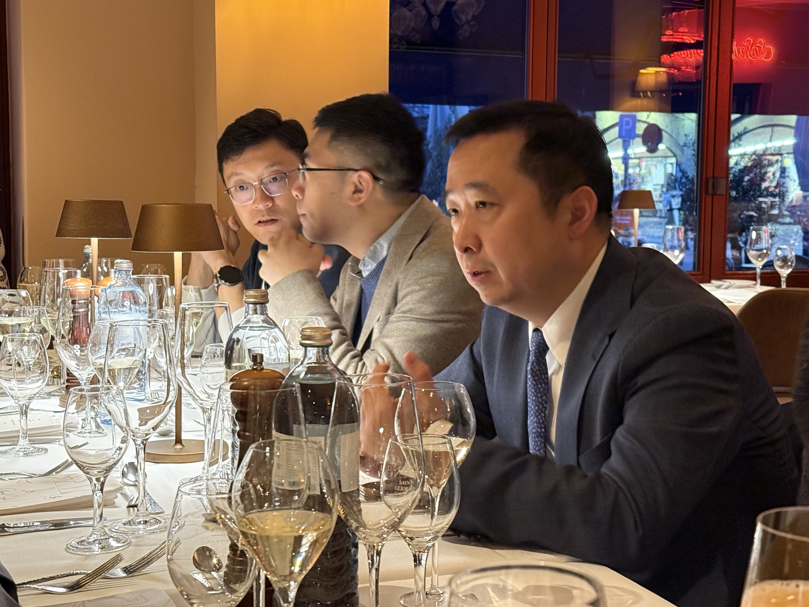
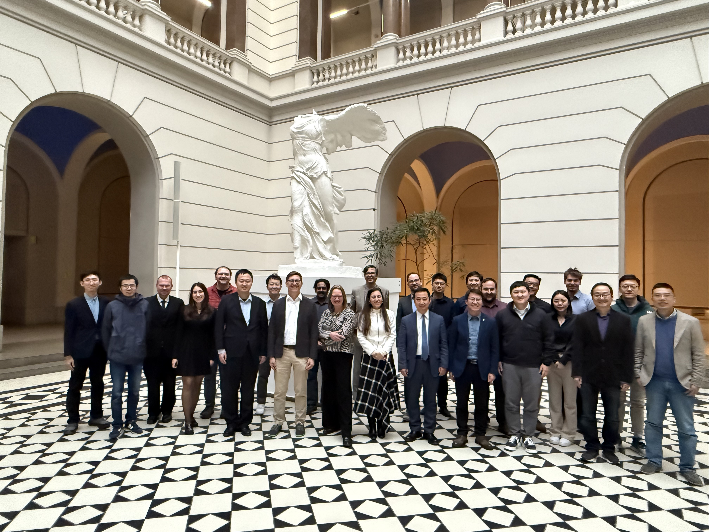
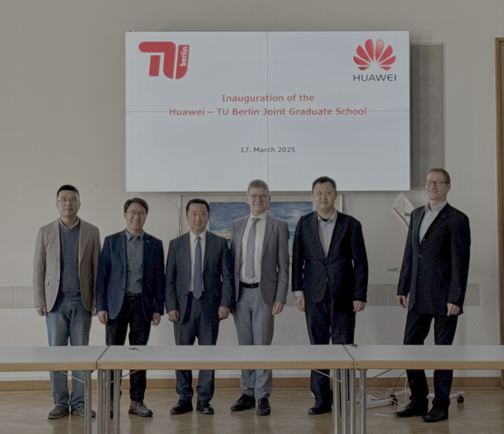

The graduate school was sucessfully inagurated on March 17, 2025. More than 40 participants from Huawei and TU Berlin, including the TUB Vice President for Research, the President of the Huawei European Research Institute, the President of the Huawei Munich Research Center, attended the event. The agenda included an introduction to the graduate school mission, its organisation, and an overview of the planned research.

 |  
 |  
 |  
 

